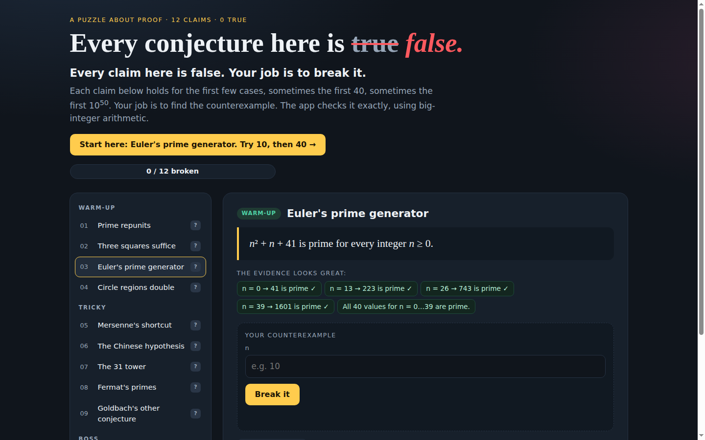

# Every Conjecture Here Is False

> Every claim here is false. Your job is to break it.

**Live demo:** https://sharonbasovich.github.io/every-conjecture-is-false/

A browser puzzle built for **Hyperbloom September 2026**. Twelve famous math claims each hold for the first few cases, sometimes the first 40, sometimes the first 10⁵⁰, and then fail. You hunt for the counterexample and the app checks it exactly with big-integer arithmetic. Once you break a claim, it stamps it **FALSE** and explains why the evidence fooled you.



## How to play (for judges)

1. Open the live demo. No login, no install.
2. Pick a claim on the left. Read the claim and the "evidence" it comes with.
3. Enter a counterexample and press **Break it**. If it doesn't break the claim, the app tells you exactly why.
4. Stuck? Each claim has a three-step hint ladder. The third hint gives the answer away.
5. Quick tour, about 60 seconds:
   - **Euler's prime generator:** try `10`, then `40`.
   - **The 52-digit liar:** open hint 3 and paste the number.

Progress is saved in your browser. **Reset progress** in the footer clears it.

## The twelve claims

| # | Tier | Claim | Breaks at |
|---|------|-------|-----------|
| 1 | Warm-up | n prime ⇒ repunit 11…1 prime | n = 3 |
| 2 | Warm-up | Every n is a sum of ≤ 3 squares | 7 |
| 3 | Warm-up | n² + n + 41 is always prime | n = 40 |
| 4 | Warm-up | Chords on n circle points make 2ⁿ⁻¹ regions | n = 6 |
| 5 | Tricky | p prime ⇒ 2ᵖ − 1 prime | p = 11 |
| 6 | Tricky | n divides 2ⁿ − 2 ⇒ n prime | 341 |
| 7 | Tricky | 31, 331, 3331, … are all prime | 333333331 |
| 8 | Tricky | Every Fermat number is prime | F(5), factor 641 |
| 9 | Tricky | Odd composites are p + 2k² | 5777 |
| 10 | Boss | A fifth power needs 5 fifth powers | 27, 84, 110, 133 → 144 |
| 11 | Boss | Cyclotomic coefficients are in {−1, 0, 1} | Φ₁₀₅ |
| 12 | Boss | gcd(n¹⁷ + 9, (n+1)¹⁷ + 9) = 1 | a 52-digit n |

## How it works

- `src/math.ts` contains BigInt number theory: Miller–Rabin (deterministic below 3.3 × 10²⁴), modular exponentiation, gcd, an exhaustive three-square search (unit-tested against Legendre's theorem), and exact cyclotomic polynomials built from the Möbius product formula.
- `src/conjectures.ts` holds the catalogue. Each claim has its own `check()` verifier that returns a human-readable verdict, plus input bounds so the browser never freezes.
- `src/main.ts` is a dependency-free TypeScript UI with progress saved in `localStorage`.
- Nothing is looked up or hard-coded as an answer key. Every submission is verified from first principles.

## Why the 52-digit boss is the *smallest* counterexample

`scripts/verify_boss.py` proves it rather than asserting it:

1. The resultant R of x¹⁷ + 9 and (x + 1)¹⁷ + 9 is an integer combination of the two polynomials, so every common divisor of their values divides R.
2. R = 8936582237915716659950962253358945635793453256935559, which the script proves prime with a recursive Pratt certificate.
3. Over GF(R) the two polynomials have a degree-1 gcd, so they share exactly one root r mod R.
4. So the counterexamples are exactly n ≡ r (mod R), and the smallest positive one is r = 8424432925592889329288197322308900672459420460792433 (≈ 8.4 × 10⁵¹). Every n ≤ 10⁵⁰ gives gcd 1.

## Develop

```bash
npm ci
npm run dev        # http://localhost:5173
npm test           # unit tests (vitest)
python3 scripts/verify_boss.py  # proof for the 52-digit boss (needs sympy)
npm run typecheck
npm run build      # static site in dist/
```

GitHub Actions runs the typecheck, tests and build on every push, then deploys `dist/` to GitHub Pages.

## Built with

TypeScript, Vite, Vitest and native BigInt. No runtime dependencies. AI-assisted development (Devin by Cognition) was used, which the Hyperbloom rules explicitly allow.

## License

MIT
